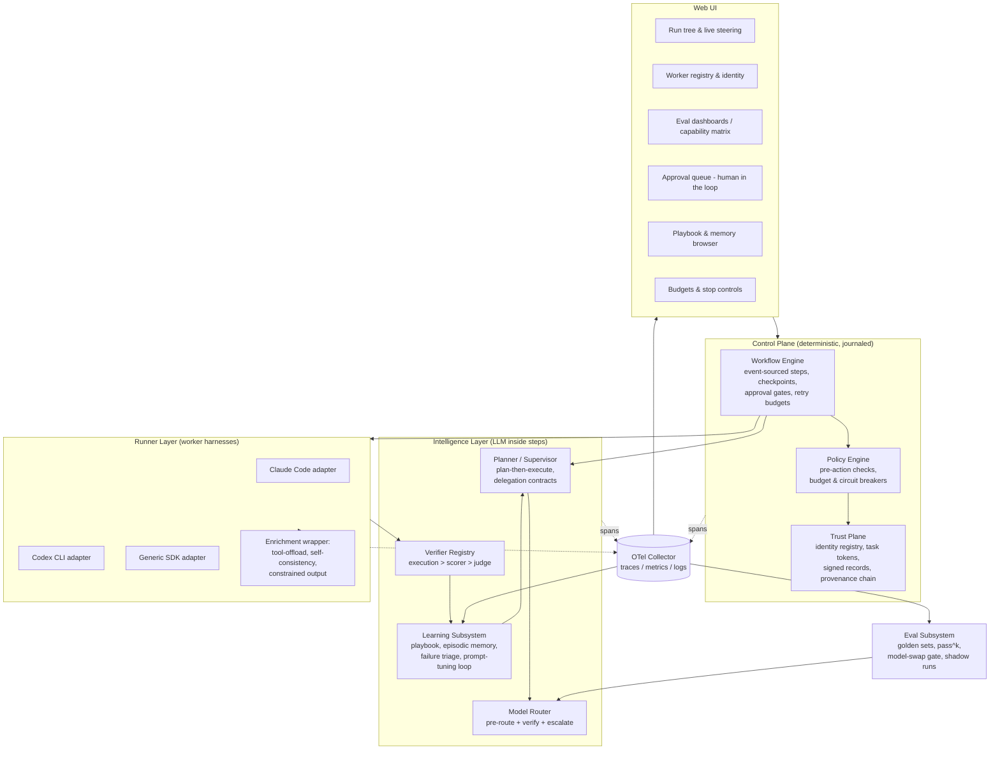

# Maestro — Meta Agent Harness: Architecture

*Status: draft v2 · 2026-07-08 · working name "maestro" (provisional)*

This document describes the current architecture under the canonical
[`Meta-Harness Project Charter`](PROJECT_CHARTER.md). Planned context, memory,
rehearsal, code-generation, H/E/W learning, and release capabilities are tracked
separately and must not be read as already implemented here.

Maestro is an intelligent **meta-harness**: a control plane that manages, orchestrates, and steers other agent harnesses (Claude Code, Codex CLI, SDK-based agents, …) through prescribed workflows. It is self-correcting, learns from past mistakes, routes tasks to the cheapest capable model tier, confirms the **authenticity** of every worker harness it drives (so it only delegates to harnesses it has registered), and exposes a web UI for management and observation.

All design choices below are grounded in the research cached in `memory/knowledge_base/` (fetched 2026-07-08); citations are in those files.

---

## 1. Design Principles

1. **Harness beats model.** Same model, different scaffolding swings coding-benchmark results by 22–36pp. Invest in delegation contracts, tool docs, verification, and context engineering before reaching for a bigger model.
2. **Deterministic spine, intelligent steps.** The workflow lifecycle (retries, checkpoints, human-approval waits, budgets) is deterministic, journaled code — "durable engine outside, agent loop inside." LLM intelligence lives *inside* steps, never in control of the lifecycle.
3. **Never trust self-assessment.** Intrinsic self-correction demonstrably fails; every correction and every termination decision is anchored to an external signal: execution result > deterministic scorer > rubric judge (decorrelated from the generator) > human.
4. **Worker output is data, not instructions.** Every worker result is treated as data — schema-validated and provenance-tagged. Instructions flow only from the principal/config down; the orchestrator's own instruction channel is never taken from a worker's returned text. Policies are enforced by the runtime, not by prompt text.
5. **Authenticity before delegation.** No task is dispatched to a worker whose identity has not been confirmed against the registry. Every action is attributable to a signed identity recorded in a verifiable provenance log (the integrity property you get from commit-signing, applied to worker actions).
6. **Test-time compute only works inside the competence envelope.** Small models + sampling/search substitute for parameters only on tasks they can partially do — so decomposition (which shrinks tasks into that envelope) is the router's most important lever.
7. **Everything is a trace.** OpenTelemetry spans are the single source of truth consumed by the web UI, the eval subsystem, the learning loop, and the provenance trail.

## 2. System Overview

## 3. Subsystems

### 3.1 Control Plane — Workflow Engine

- **Prescribed workflows** are YAML definitions (version-controlled, PR-reviewed) compiled into journaled step sequences. Code is the source of truth; YAML is the authoring surface for fixed processes; the Planner decomposes the open-ended steps at runtime.
- **Durable by journaling.** Every step's inputs, outputs, and side-effect receipts are appended to a run journal. A crash or a deliberate pause resumes by replaying the journal and skipping completed steps — no work is silently redone. This is the "resume from checkpoint, don't restart" lesson applied literally.
- **Human-approval gates** are a first-class state. A step can mark itself as awaiting approval; the run durably parks (zero compute) until a decision arrives from the web UI. DSL gates default to `hitl_timing: before` for backward-compatible permission checks; `hitl_timing: after` parks after the verified step output is recorded so the human reviews the artifact itself. The Software Engineering template's spec, plan, and ship gates use the post-artifact form. Gates are placed at plan approval, before any irreversible action, at stage boundaries, and on low-confidence triggers.
- **Guardrails** live in one place (`core/budget.py`): hard cost/token ceilings, plateau detection (stop iterating when scores stop improving), step-repetition detection (dedup action signatures), and per-tool circuit breakers.

### 3.2 Intelligence Layer

- **Planner / Supervisor** turns an objective into a plan of tasks, each carrying an explicit delegation contract (objective, output format, boundaries) and an effort-scaling hint. Plan-then-execute: the plan is fixed from trusted input before any worker output is read back in.
- **Model Router** (see 3.4) picks the cheapest tier likely to succeed and escalates on a verifiable failure signal.
- **Verifier Registry** resolves the strongest available check for a task: execution/tests > deterministic scorer > rubric judge (decorrelated from the generator) > human. For `code_edit`, a v2 worker signature attests the workspace root; a fixed argv allowlist discovers pytest or npm tests and runs them in a network-denied OS sandbox with bounded time/output. Missing checks, missing test runtimes, legacy signatures, or unavailable isolation fall back to the evidence-fed judge. A verifier is *never* the same context that produced the output.
- **Learning Subsystem** (see 3.5) writes lessons into an evolving playbook and, on a slower cadence, tunes prompts/routing rules from clustered failures.

### 3.3 Trust Plane — Worker Authenticity & Provenance

Framed strictly as integrity/authenticity — the same guarantees you get from signed git commits or verified JWTs, applied to worker harnesses.

- **Signed identities.** Each worker harness holds an Ed25519 private key; the orchestrator holds its public key in a registry. A worker proves it is the one it claims to be by signing its registration and each result. The orchestrator confirms the signature before accepting the worker or its output.
- **Scoped capability tokens.** Each delegated task carries a short-lived token naming the principal (who initiated) and the agent (which worker acts), scoped to that one task. Tokens expire when the task completes.
- **Provenance chain.** Every worker action produces a compact signed record appended to a hash-chained log — each entry commits to all prior entries, so the record stays internally consistent and any later edit is detectable. This makes every action attributable to a confirmed identity and gives the run a verifiable history.

### 3.4 Model Router / Cascade

- **Pre-route** on task type + a cheap complexity estimate to a starting tier (small / mid / frontier).
- **Cascade**: run the chosen tier, verify with the strongest available scorer, and
  **escalate only on a verifiable failure** (failed test, invalid schema, low
  self-consistency agreement) — never on raw self-reported confidence. A timeout is
  treated as an operational signal: retry the same tier once before escalating, and
  do not record timeout FAILs as negative capability evidence.
- **Capability matrix** (produced by the eval subsystem) sets the default tier per task type and encodes where a cheaper model is known-safe.
- **Enrichment stack** for the small tier, in ROI order: tool-offload (arithmetic/date/string work goes to code execution), self-consistency voting, dynamic exemplar retrieval, constrained/flat-schema output, and prompt compilation with a frontier teacher.

### 3.5 Self-Correction & Learning

- **Fast loop (per task):** after a failed attempt, a Reflector (a *different* context from the actor) reads the execution feedback, labels the failure with a MAST mode, and writes a short lesson. Lessons are merged into the playbook by **delta update** — grow-and-refine, never wholesale rewrite — to avoid context collapse and brevity bias.
- **Playbook** = itemized bullets (strategy / domain fact / known failure mode) with usefulness metadata, retrieved into future task prompts. Plus an exemplar store of solved tasks retrieved as few-shot demonstrations.
- **Slow loop (batch/offline):** cluster labeled failures, run a reflective prompt-tuning pass on the relevant prompt or routing rule, and adopt the change **only if it passes the regression suite** — every past failure becomes a standing regression case.
- **Consolidation** runs offline to merge duplicate lessons and retire ones contradicted by newer evidence.

### 3.6 Eval Subsystem — Model-Swap Gate

- **Golden sets** per task type, versioned and decoupled from any run.
- **pass^k gating** (k≥4–8): a task must succeed on *all* k runs, not just one — single-run rates overstate reliability.
- **State-verification scorers**: judge by comparing final state to a goal state, not by grading text.
- **Capability matrix**: rows = task types, columns = quality / pass^k / cost / latency; the per-task-type delta is the release decision, not the aggregate.
- **Third-party judge** (neither incumbent nor candidate model), binary rubrics, both-order pairwise, calibrated against human labels.
- **Go/no-go report** with paired-difference statistics; below a few hundred examples per cell, use bootstrap intervals.

### 3.7 Observability

- Every layer emits OpenTelemetry spans with attributes for model, tier, tokens, cost, verdict, and MAST label (as a span event on failure). An in-memory span store feeds the web UI live; the same provider can fan out to a real OTLP collector.

### 3.8 Web UI

- Live run tree with step timeline (from spans), worker registry & identity status, provenance log viewer, playbook & failure-taxonomy browser, capability matrix / eval reports, and controls to launch, steer, approve gates, and stop runs.
- **Home landing** (structure-lab pattern): a single next-action card answers "what do I do right now?" — integrity alerts first, then run approvals, pending promotions, setup steps — above stat tiles and latest-result cards. **Help** documents every view in plain language.
- **AI companion (✦)**: one gradient sparkle marks every AI-advisory element — the Goal-step prompt assistant, advisor panels on tuning candidates, and card-level reads on three console cards: **routing** ("Who's good at what"), **failures** ("Why runs fail"), and **playbook** ("Lessons learned"). Each card panel pairs a deterministic verified-facts block (built from data already on the live loop) with the companion's read and suggested next actions. The companion runs as a normal Task through the harness's own most capable runner, schema-guarded to `{read, next_actions}` with a closed action vocabulary the UI executes deterministically; on the card-level placements, suite-targeting actions (start_tune/add_coverage) fire only with a valid advisor-named suite, enforced on both the render and handler side (the tuning card keeps its original fallback to the user-selected suite). All recorded output enters its prompt inside an `<untrusted-data>` fence. Everything without the sparkle is verified, deterministic data.

### 3.9 Harness Self-Optimization (Meta-Harness outer loop)

Implements arXiv 2603.28052 over this harness's own configuration (`optimization/`;
research distilled in `memory/knowledge_base/meta-harness-optimization.md`):

- **Candidate ledger on disk** — one directory per candidate (params, scores, proposer
  hypothesis, lineage, and the **raw** per-attempt eval traces). Raw is load-bearing: the
  paper's ablation shows summarized traces cost ~15 accuracy points, so `digest_text`
  never touches them. Rejected proposals are recorded too — the proposer learns from
  rejections the way the paper's proposer learns from regressions.
- **Proposers** share one contract: read the ledger, return `{hypothesis, parent, delta}`.
  `LLMProposer` is the paper's shape (frontier worker over raw traces, picks its own
  parent, schema-guarded output); `RuleProposer` is a deterministic fallback running the
  same counterfactual diagnosis with fixed rules, so the loop works offline.
- **Search space (v1)** is config-space: the enrichment stack (tool offload, consistency
  k, schema retries, critique rounds) plus additive-only prompt directives. Pydantic
  bounds are the paper's interface-validation gate — invalid deltas are rejected loudly,
  never silently evaluated.
- **Code-space search** extends the candidate beyond knobs: a candidate may carry a CODE
  artifact — `params.code_ref`, a ledger-root-relative `.py` module defining
  `build(base) -> Runner` — applied OUTERMOST over the knob stack (`params.build` requires
  a `ledger_root` for code-backed params and enforces realpath containment, so the three
  build sites — evaluation, serve-boot apply, web approval — never resolve against the
  cwd). A deterministic, LLM-free `code_gate` is the code counterpart to the pydantic gate,
  enforcing the paper's interface-validation + edit-scope + decontamination trio: the
  module must present the `build` contract (checked by importing in a timeout-bound
  subprocess), stay inside the ledger root, and never embed a held-out answer. Gate
  failures are recorded as rejected candidates exactly like a bad delta; a passing artifact
  is frozen into an immutable `candidates/<cid>/harness.py` **before** it is scored, its
  `code_hash` is taken over those canonical bytes, and `build()` re-verifies the hash on
  every load — so what runs is exactly what is recorded and promoted, and dedup keys on
  `code_hash` (same source at two paths is one candidate). Decontamination is **best-effort**,
  at the string/AST-literal level: raw substrings and constant-folded split literals
  (`"19"+"32"`) are caught, but determined obfuscation (`chr()` chains, runtime construction)
  is out of scope — the same posture as the paper, mitigated by held-out inspection instead.
  The `CodeProposer`, CLI flag, and dashboard wiring are the designed follow-on.
- **Scoring** is multi-objective: pass^k against a domain suite (classification,
  extraction, math, or mixed — deliberately not SDLC-only) with token cost tracked, kept
  as a **Pareto frontier**, not a greedy incumbent. A plateau detector stops stalled
  searches; a `Budget` puts a hard ceiling on the whole run.
- **Promotion** reuses the eval gate over the whole frontier: every contender is judged
  on a **held-out** suite (`compare_suites`) and promotable ones are ranked by held-out
  objectives — search-set numbers, search order, or "no regression" alone never promote.
  CLI searches promote automatically; WebUI-started searches park the winner as a
  **pending promotion** behind the human approval gate, and approving rewires the live
  small-tier runner immediately. Promoted params land in
  `optimization/<suite>/promoted.json` and re-apply at every serve boot.

## 4. Runner Adapter Contract

Every worker harness — however it calls its model internally — is wrapped behind one uniform interface: **messages + files in → text stream + tool calls out**. Adapters exist for headless CLI harnesses (driven via their non-interactive modes) and SDK agents. Per-worker isolation is **directory-per-task workspaces** under `~/.metaharness/workspaces` with path-jailed file tools (corrected 2026-07-19: git-worktree isolation was previously claimed here but is not implemented — see META-18; concurrent workers on one shared repo currently have no branching story).

## 5. Build Phases

1. Core types, budgets, tracing. *(done)*
2. Trust plane: signed identities, registry, task tokens, provenance chain.
3. Runner abstraction + local workers + enrichment wrapper.
4. Model router / cascade.
5. Orchestrator + durable journaled workflow spine + YAML DSL.
6. Self-correction & learning subsystem.
7. Eval subsystem + capability matrix.
8. OTel wiring across all layers.
9. Web UI.
10. End-to-end demo + real artifact tests.
11. Harness self-optimization: Meta-Harness outer loop over the enrichment stack. *(done — v1 config-space)*

## 6. selflearn Harness-Primitive Scorecard

Alignment of the `selflearn` module against the ten harness primitives
(harness-engineering masterclass taxonomy; reviewed 2026-07-19). The key
reading rule: selflearn is a harness **component**, not a competing
harness — several primitives are *deliberately host-delegated* through its
five ports, and a ◐ there is a design boundary, not a deficit. This
section is the written record of that boundary, so nobody "completes"
primitives that were excluded on purpose.

Measured 2026-07-19 against a rubric of capabilities the masterclass
ascribes to each primitive: 1 = implemented with cited evidence, 0.5 =
partial, 0 = absent, D = host-delegated (excluded from the in-scope
denominator).

| # | Primitive | Measured | Notes (evidence anchors) |
|---|---|---|---|
| 1 | Instruction | **1.5/4 (38%)** | `archetype_prompt` exists but is rendered nowhere (dead config); constraints are routing-only; sole delivered instruction is the injection header directive (`injection.py:17`) |
| 2 | Context delivery | **4/4 (100%)** | `render_injection_block`: fenced notes, per-note url+locator citations, cite-back `applied_knowledge` protocol |
| 3 | Context management | **5/6 (83%)** | Evidence-decayed ranking; budget skip-don't-bust (`retriever.py:160`); `injection_screen` + untrusted-advisory fencing; `degraded` flag. Missing: summarization/compaction |
| 4 | Tool interface | **2/2** (2 D) | Typed ports + contract validation; model-initiated calls and discovery delegated (arch principle 2) |
| 5 | Execution environment | **2/2** (2 D) | `ExecutionPort` + loud refusal (`verifier.py:151`); scope/isolation delegated |
| 6 | Durable state | **5/5 (100%)** | Restart-surviving learner state, plain-file store, baselines, journaled decisions, `JsonlProvenance` |
| 7 | Orchestration | **3/4 (75%)** (1 D) | Gates + ordered pipeline + human handoff; **retries absent even in-scope** (transient judge failure kills a run); hooks delegated |
| 8 | Sub-agents | **2.5/3 (83%)** (1 D) | Bounded specs, narrowed context; `TaskOutcome` as integration contract (0.5); spawning delegated |
| 9 | Skills / procedures | **5/5 (100%)** | Workflow kind, `depends_on`-validated steps, `tools` prefs, task-time loading via retrieval |
| 10a | Verification | **5/5 (100%)** | Gates, three check kinds, evalgen with *enforced* author≠validator (`evalgen.py:55`), regression, de7df24 |
| 10b | Observability | **2.5/5 (50%)** | Provenance journal + doctor; model-call traces and cost absent → **META-13**; run reconstruction partial |
| — | Evolution (capstone) | **6/6 (100%)** | marks→deprecation, gaps→proposals, consumed failures + backoff, epistemic signals, durable compounding |

**Overall in-scope: 43.5/51 = 85%** · 6 criteria host-delegated by design
(4, 5 partially, 7 hooks, 8 spawning). Actionable, in measured order:
instruction rendering (38% — `archetype_prompt` is dead config until
something renders it), observability (50% —
[META-13](https://linear.app/cha-personal/issue/META-13/selflearn-trace-modelport-calls-timestamp-all-provenance-events)),
in-pipeline retries (orchestration 75%), injected-context compaction
(context mgmt 83%).

### 6.1 Agent-Memory Scorecard

Same measurement discipline against the agent-memory masterclass taxonomy
(working / episodic / semantic / procedural memory + forgetting hygiene;
"memory is context assembly over time"). Measured 2026-07-19.

| Memory concern | Measured | Notes (evidence anchors) |
|---|---|---|
| Working memory / context assembly | **4/4 (100%)** | Context builder = `Retriever` → rank → `render_injection_block`; budget skip-don't-bust; injected slice fully accounted (`InjectionBlock.entry_ids` + `TaskOutcome.injected`) |
| Episodic ("it has a *when*") | **3/4 (75%)** | Marks and sources are dated, but **journal events are unstamped** (`packstore.py:472` writes payloads verbatim) and `TaskOutcome`/retained failures carry no time field → META-13 gap 2. No event-search API (grep-only journal) |
| Semantic (standing facts) | **4/5 (80%)** | Store/update/retire all journaled and reversible; preference guard in injection framing. Missing: **fact-contradiction detection** — two published entries can conflict and nothing notices until marks slowly bury one (verifier checks claims against sources, never against each other) |
| Procedural (how-to) | **4/4 (100%)** | Workflow kind, task-match loading, staleness via marks with `step_id` targeting the failing step, procedure-in-orchestration gates |
| Forgetting / hygiene | **4/5 (80%)** | Half-life decay + min(lifetime, decayed); curation via quarantine/journaled release; deprecated lose retrievability, not existence. Partial: contradiction handling is evidence-driven only; **episodic failures FIFO-drop instead of compressing** (sessions→summaries ladder has only its ingest rung) |

**Overall: 19/22 = 86%.** The weak spots differ from §6's: the memory
lens exposes the missing "when" (folded into META-13 — one stamped-trace
change fixes both §6 observability and episodic dating), fact-contradiction
detection (a publish-time or doctor-pass check between same-topic published
entries), and episodic compression (summarize before the FIFO cap drops
evidence). Strengths are the same story told twice: the context-builder
column is the module's reason to exist, and evidence-decayed ranking is a
mathematical implementation of "old memory should not outrank what is
true."

### 6.2 Full-Harness Primitive Scorecard (metaharness + selflearn)

Measured 2026-07-19 via three-agent evidence sweep over
`src/metaharness/` (~30k lines), same rubric discipline as §6. This is
the scorecard for the *whole current harness* — it covers the primitives
§6 marks host-delegated.

| # | Primitive | Measured | Key evidence / gaps |
|---|---|---|---|
| 1 | Instruction | **4/4 (100%)** | `AgentConfig.system_prompt` → `_build_messages` (`harness/local.py:41-59`) every dispatch; CLI `--append-system-prompt`; per-attempt reflection advice into `task.boundaries` (`core/executor.py:97-104`); `KNOWLEDGE_ARCHETYPES` presets |
| 2 | Context delivery | **3.5/4 (88%)** | Live but **fragmented**: two parallel builders (`local.py:_build_messages`, `coding.py:_render_prompt`) + advice channel (execution receipts, playbook hints, selflearn injection via `web/state.py:214-228`). The typed `ContextEnvelope`/manifest (`context/assembly.py`) is **shadow-only** — no unified live assembler |
| 3 | Context management | **3.5/5 (70%)** | Tier token budgets enforced live (`fit_messages`, `assembly.py:111-135`); but live-path pruning is role/length, not relevance (only selflearn's slice is ranked); compaction is head/tail digest only (`STRUCTURED_SUMMARY` modeled, unimplemented); injection screening covers selflearn fencing but not tool outputs; secret redaction shadow-only |
| 4 | Tool interface | **4/4 (100%)** | `ToolSpec` + deterministic OpenAI schemas + MCP mirroring (`tools/mcp.py:96-150`); multi-round model-initiated calls; errors-as-data, digested results, relevance-capped ≤7-tool subsets (`select_for`) |
| 5 | Execution environment | **3.5/5 (70%)** | Seatbelt/bwrap sandbox (network-deny, cred-stripped env, allowlisted argv) is real but wraps **only verification runs** — worker generative execution gets workspace dirs + path-jail + CLI-native sandboxing; no git worktrees (§4 corrected); capability tokens dead code → **META-18** |
| 6 | Durable state | **5/5 (100%)** | Journal-first fsync'd workflow engine with resume/archive; playbook; atomically persisted capability matrix; 4-type SQLite memory substrate (shadow phase by design, TASK-004) |
| 7 | Orchestration | **5/5 (100%)** | Journaled engine + HITL gates surviving restart (`AWAITING_APPROVAL`); retries with budgets + evidence-driven tier escalation; event-sink lifecycle hooks incl. per-tool-call interception; plateau/dedup stop controls |
| 8 | Sub-agents | **3/4 (75%)** | One worker per attempt via router; bounded (tools ≤7, budgets, host-chain recursion guard); integration via verify→reflect→matrix→provenance. No parallel fan-out; pre-dispatch identity gate missing (registry verifies results post-hoc only) |
| 9 | Skills / procedures | **3.5/4 (88%)** | Playbook curated bullets (Laplace-scored, deprecating); selflearn workflow entries injected; DSL StepSpec = procedure-as-orchestration. `plan_from_knowledge` exported with **zero call sites** ("until M5"); learned procedures still prose-interpreted → META-17 |
| 10a | Verification | **5/5 (100%)** | Verifier hierarchy (execution > schema > judge, never false PASS, `UNVERIFIED` class); judge decorrelated (fresh context, separate runner); pass^k + paired sign test + sealed holdouts; authenticity gate before scoring; workspace attestation (sig v2) |
| 10b | Observability | **4.5/5 (90%)** | Real OTel + OTLP export; cost/latency/tokens on every `WorkerResult`, journaled; tool-call events; signed hash-chained `ProvenanceLog`. What-model-saw capture only in shadow manifest (redacted sidecar) |
| — | Evolution (capstone) | **6/6 (100%)** | Fast/slow `LearningLoop` (reflection + MAST clustering → playbook curation with deprecation); `harvest.py` turns run journals into eval-suite material (failures→tests, literally); optimization outer loop (proposer→gate→Pareto→holdout→human promotion, v1 done); selflearn knowledge loop; capability-matrix learning |

**Overall: 50.5/56 = 90%.** Dead-code pattern found four times across
the stack (`archetype_prompt`, `identity/tokens.py`,
`plan_from_knowledge`, `STRUCTURED_SUMMARY`): built capability that
nothing calls — tracked as a class in META-22. The shadow-first staging
of memory/context envelopes is deliberate (TASK-002/004) and scored as
storage, not as wiring.

**Gap → plan map (every sub-100% score accounted for):**

| Scorecard gap | Issue |
|---|---|
| selflearn observability + missing event timestamps (§6 10b, §6.1 episodic) | META-13 |
| selflearn instruction 38% — dead `archetype_prompt` (§6 #1) | META-14 |
| selflearn fact-contradiction detection (§6.1 semantic) | META-15 |
| selflearn pipeline retries + episodic compression (§6 #7, §6.1 hygiene) | META-16 |
| Learned workflows prose-interpreted; compile to cross-validated executors (§6.2 #9) | META-17 |
| Worker-side sandboxing, worktree claim, dead capability tokens (§6.2 #5, #8 pre-dispatch gate) | META-18 |
| Shadow ContextEnvelope → live path: unified assembler, trust tags, redaction, what-model-saw (§6.2 #2, #10b) | META-19 |
| Live-path relevance ranking, semantic compaction, tool-output screening (§6.2 #3) | META-20 |
| Parallel sub-agent fan-out (§6.2 #8; blocked by META-18 isolation decision) | META-21 |
| Dead-capability CI check (cross-cutting pattern) | META-22 |

Accepted-as-is (declared, not filed): selflearn injected-context
compaction (§6 #3 — its block is already budget-capped per entry);
host-delegated primitives per the §6 boundary; memory-substrate live
wiring (staged shadow-first by TASK-004's own design).
