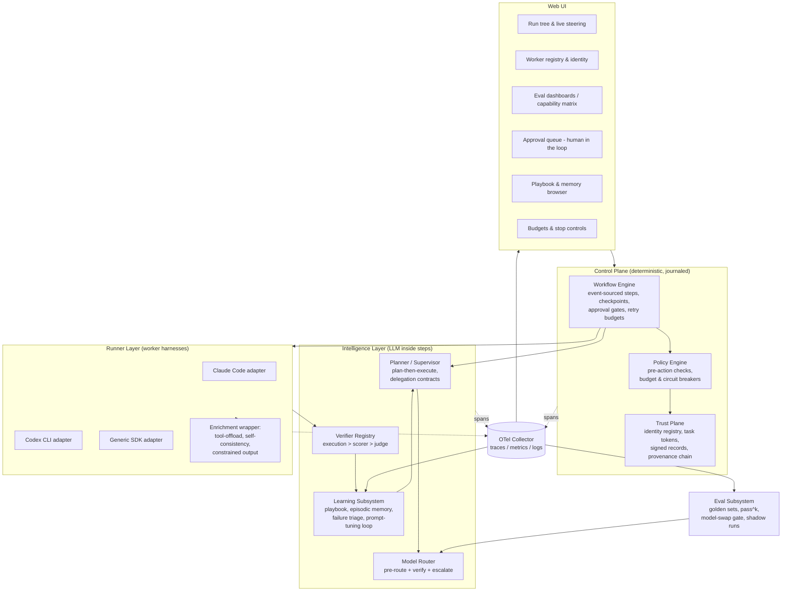

# Maestro — Meta Agent Harness: Architecture

*Status: draft v2 · 2026-07-08 · working name "maestro" (provisional)*

Maestro is an intelligent **meta-harness**: a control plane that manages, orchestrates, and steers other agent harnesses (Claude Code, Codex CLI, SDK-based agents, …) through prescribed workflows. It is self-correcting, learns from past mistakes, routes tasks to the cheapest capable model tier, confirms the **authenticity** of every worker harness it drives (so it only delegates to harnesses it has registered), and exposes a web UI for management and observation.

All design choices below are grounded in the research cached in `memory/knowledge_base/` (fetched 2026-07-08); citations are in those files.

---

## 1. Design Principles

1. **Harness beats model.** Same model, different scaffolding swings coding-benchmark results by 22–36pp. Invest in delegation contracts, tool docs, verification, and context engineering before reaching for a bigger model.
2. **Deterministic spine, intelligent steps.** The workflow lifecycle (retries, checkpoints, human-approval waits, budgets) is deterministic, journaled code — "durable engine outside, agent loop inside." LLM intelligence lives *inside* steps, never in control of the lifecycle.
3. **Never trust self-assessment.** Intrinsic self-correction demonstrably fails; every correction and every termination decision is anchored to an external signal: execution result > deterministic scorer > rubric judge (decorrelated from the generator) > human.
4. **Worker output is data, not instructions.** Every worker result is treated as data — schema-validated and provenance-tagged. Instructions flow only from the principal/config down; the orchestrator's own instruction channel is never taken from a worker's returned text. Policies are enforced by the runtime, not by prompt text.
5. **Authenticity before delegation.** No task is dispatched to a worker whose identity has not been confirmed against the registry. Every action is attributable to a signed identity recorded in a verifiable provenance log (the integrity property you get from commit-signing, applied to worker actions).
6. **Test-time compute only works inside the competence envelope.** Small models + sampling/search substitute for parameters only on tasks they can partially do — so decomposition (which shrinks tasks into that envelope) is the router's most important lever.
7. **Everything is a trace.** OpenTelemetry spans are the single source of truth consumed by the web UI, the eval subsystem, the learning loop, and the provenance trail.

## 2. System Overview

## 3. Subsystems

### 3.1 Control Plane — Workflow Engine

- **Prescribed workflows** are YAML definitions (version-controlled, PR-reviewed) compiled into journaled step sequences. Code is the source of truth; YAML is the authoring surface for fixed processes; the Planner decomposes the open-ended steps at runtime.
- **Durable by journaling.** Every step's inputs, outputs, and side-effect receipts are appended to a run journal. A crash or a deliberate pause resumes by replaying the journal and skipping completed steps — no work is silently redone. This is the "resume from checkpoint, don't restart" lesson applied literally.
- **Human-approval gates** are a first-class state. A step can mark itself as awaiting approval; the run durably parks (zero compute) until a decision arrives from the web UI. Gates are placed at plan approval, before any irreversible action, at stage boundaries, and on low-confidence triggers.
- **Guardrails** live in one place (`core/budget.py`): hard cost/token ceilings, plateau detection (stop iterating when scores stop improving), step-repetition detection (dedup action signatures), and per-tool circuit breakers.

### 3.2 Intelligence Layer

- **Planner / Supervisor** turns an objective into a plan of tasks, each carrying an explicit delegation contract (objective, output format, boundaries) and an effort-scaling hint. Plan-then-execute: the plan is fixed from trusted input before any worker output is read back in.
- **Model Router** (see 3.4) picks the cheapest tier likely to succeed and escalates on a verifiable failure signal.
- **Verifier Registry** resolves the strongest available check for a task: execution/tests > deterministic scorer > rubric judge (decorrelated from the generator) > human. A verifier is *never* the same context that produced the output.
- **Learning Subsystem** (see 3.5) writes lessons into an evolving playbook and, on a slower cadence, tunes prompts/routing rules from clustered failures.

### 3.3 Trust Plane — Worker Authenticity & Provenance

Framed strictly as integrity/authenticity — the same guarantees you get from signed git commits or verified JWTs, applied to worker harnesses.

- **Signed identities.** Each worker harness holds an Ed25519 private key; the orchestrator holds its public key in a registry. A worker proves it is the one it claims to be by signing its registration and each result. The orchestrator confirms the signature before accepting the worker or its output.
- **Scoped capability tokens.** Each delegated task carries a short-lived token naming the principal (who initiated) and the agent (which worker acts), scoped to that one task. Tokens expire when the task completes.
- **Provenance chain.** Every worker action produces a compact signed record appended to a hash-chained log — each entry commits to all prior entries, so the record stays internally consistent and any later edit is detectable. This makes every action attributable to a confirmed identity and gives the run a verifiable history.

### 3.4 Model Router / Cascade

- **Pre-route** on task type + a cheap complexity estimate to a starting tier (small / mid / frontier).
- **Cascade**: run the chosen tier, verify with the strongest available scorer, and **escalate only on a verifiable failure** (failed test, invalid schema, low self-consistency agreement) — never on raw self-reported confidence.
- **Capability matrix** (produced by the eval subsystem) sets the default tier per task type and encodes where a cheaper model is known-safe.
- **Enrichment stack** for the small tier, in ROI order: tool-offload (arithmetic/date/string work goes to code execution), self-consistency voting, dynamic exemplar retrieval, constrained/flat-schema output, and prompt compilation with a frontier teacher.

### 3.5 Self-Correction & Learning

- **Fast loop (per task):** after a failed attempt, a Reflector (a *different* context from the actor) reads the execution feedback, labels the failure with a MAST mode, and writes a short lesson. Lessons are merged into the playbook by **delta update** — grow-and-refine, never wholesale rewrite — to avoid context collapse and brevity bias.
- **Playbook** = itemized bullets (strategy / domain fact / known failure mode) with usefulness metadata, retrieved into future task prompts. Plus an exemplar store of solved tasks retrieved as few-shot demonstrations.
- **Slow loop (batch/offline):** cluster labeled failures, run a reflective prompt-tuning pass on the relevant prompt or routing rule, and adopt the change **only if it passes the regression suite** — every past failure becomes a standing regression case.
- **Consolidation** runs offline to merge duplicate lessons and retire ones contradicted by newer evidence.

### 3.6 Eval Subsystem — Model-Swap Gate

- **Golden sets** per task type, versioned and decoupled from any run.
- **pass^k gating** (k≥4–8): a task must succeed on *all* k runs, not just one — single-run rates overstate reliability.
- **State-verification scorers**: judge by comparing final state to a goal state, not by grading text.
- **Capability matrix**: rows = task types, columns = quality / pass^k / cost / latency; the per-task-type delta is the release decision, not the aggregate.
- **Third-party judge** (neither incumbent nor candidate model), binary rubrics, both-order pairwise, calibrated against human labels.
- **Go/no-go report** with paired-difference statistics; below a few hundred examples per cell, use bootstrap intervals.

### 3.7 Observability

- Every layer emits OpenTelemetry spans with attributes for model, tier, tokens, cost, verdict, and MAST label (as a span event on failure). An in-memory span store feeds the web UI live; the same provider can fan out to a real OTLP collector.

### 3.8 Web UI

- Live run tree with step timeline (from spans), worker registry & identity status, provenance log viewer, playbook & failure-taxonomy browser, capability matrix / eval reports, and controls to launch, steer, approve gates, and stop runs.

## 4. Runner Adapter Contract

Every worker harness — however it calls its model internally — is wrapped behind one uniform interface: **messages + files in → text stream + tool calls out**. Adapters exist for headless CLI harnesses (driven via their non-interactive modes) and SDK agents. Per-worker isolation uses git worktrees so parallel workers don't collide.

## 5. Build Phases

1. Core types, budgets, tracing. *(done)*
2. Trust plane: signed identities, registry, task tokens, provenance chain.
3. Runner abstraction + local workers + enrichment wrapper.
4. Model router / cascade.
5. Orchestrator + durable journaled workflow spine + YAML DSL.
6. Self-correction & learning subsystem.
7. Eval subsystem + capability matrix.
8. OTel wiring across all layers.
9. Web UI.
10. End-to-end demo + real artifact tests.
